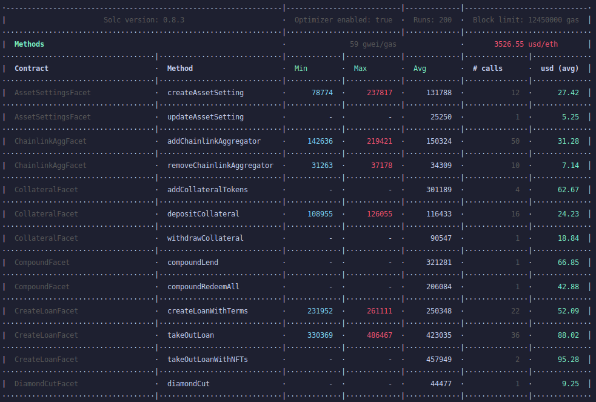

# Teller V1 Protocol

Teller V1 is a composition of smart contracts, which create the protocol. These contracts enable digital asset holders on the Ethereum blockchain to engage in decentralized, lending and borrowing activities, with down to zero collateral.

The protocol is currently in beta and deployed on the Kovan testnet. We envision the protocol to evolve into a decentralized, community-run project, maintained by a DAO (Decentralized Autonomous Organization) structure.

If you would like to contribute, we encourage you to submit a PR directly or join the open-source team at hello@teller.finance.

## Resources

- Website → https://teller.finance/
- Twitter → https://twitter.com/useteller
- Discord → https://discord.com/invite/Ujnvh8d

## Prerequisites

### NodeJS Version

> This is important to have a stable NodeJS version installed. At the moment of writing this document, the team is using the NodeJS **v14.15.4 (Fermium LTS)** without issues.

### Install Dependencies / Setup

To make the development process easier, we use [Hardhat](https://hardhat.org/) to develop and manage the smart contracts.

Run `yarn setup` to perform the necessary steps to get the repository setup.

It will:

- Install required package dependencies
- Create a `.env` file by using the predefined `.env.template`

After this, you will need to make sure that the following variables are defined in the `.env` file:

- `MNEMONIC_KEY` - Used to interact with or deploy smart contracts on a network.
  - **The default value is PUBLIC and should NOT be used for anything other than testing locally**
- Alchemy nodes used to deploy smart contracts on their respective networks
  - `ALCHEMY_MAINNET_KEY`
  - `ALCHEMY_RINKEBY_KEY`
  - `ALCHEMY_ROPSTEN_KEY`
  - `ALCHEMY_KOVAN_KEY`
- `ETHERSCAN_API_KEY` - Used to verify smart contracts after deployment
- `CMC_KEY` - Used to fetch gas pricing info when running tests
- `GAS_PRICE_GWEI_KEY` - Default gas price to use when running Hardhat

## Get Started

After installing dependencies and setup, you are able to:

- Execute tests / code coverage
- Deploy the protocol
- Interact with existing deployments on a network
- Fork a network locally

Hardhat creates a local ganache RPC network instance and deploys all contracts to it.

To create a localhost network:

- `yarn hh node`

To verify if instances have been deployed, check `deployments/localhost`

For a deeper dive into available commands see the [tasks documentation](docs/tasks.md)

### Running Unit Tests

Execute the command:

- `yarn test`

As result, you should see:

© Copyright 2021, Teller
